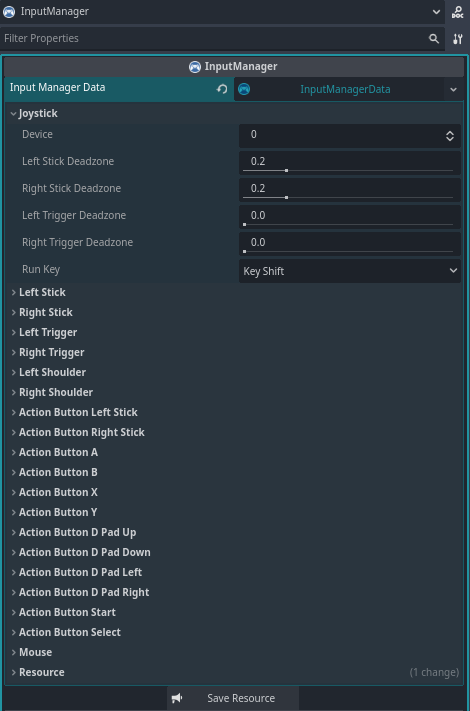
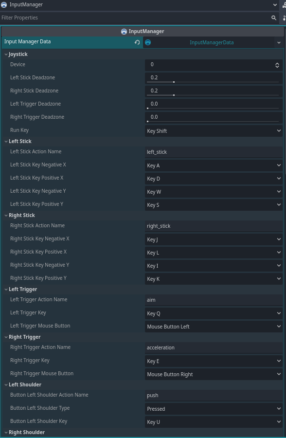
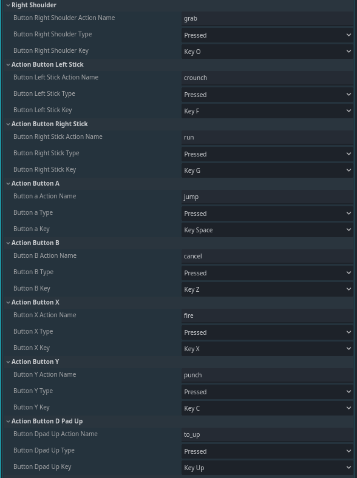
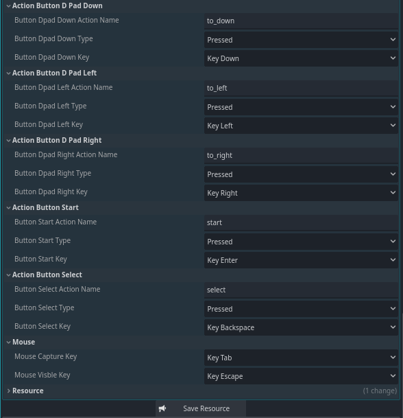

<h1 align="center"> Input Manager </h1>

<div align="center">

</div>

<h3 align="center">Advanced Input System for Godot 4.5+</h3>

## Description

**InputManager** is a plugin for **Godot 4.5x** used to receive and handle gamepad events, as well as to configure inputs in an easier and more practical way. Each gamepad action can be named and assigned a key to be handled according to the player's actions. Action buttons can have their states changed to **PRESSED** (when held down), **RELEASED** (when the button is released), **ONESHOT** (for a single shot), and **TOGGLE** (to toggle the value).

Features include:

- **Select the device** connected to the pc
- **Configurable Deadzone** for analog sticks and triggers buttons
- **Toggle, Oneshot, and Release Events**
- **Dynamic Action and Button Mapping**
- **Support for Multiple Gamepads**
- **Built-in Signals** for easy integration
- **Controller Vibration (Rumble)**
- **Script or Inspector Configuration**

Perfect for **3D or 2D games** of any genre — platformer, shooter, racing, RPG, and more.

---

## Key Features

| Feature          | Description                                     |
| ---------------- | ----------------------------------------------- |
| Input Mapping    | Supports keyboard, mouse, and multiple gamepads |
| Deadzone         | Defines analog stick neutral zone               |
| Toggle / Oneshot | Persistent and pulse-style events               |
| Built-in Signals | Easily connect to scripts and nodes             |
| Vibration        | Configurable controller rumble                  |
| Auto Detection   | Detects devices and actions in real-time        |

---

## Installation

1. Download the plugin files.
2. Extract the files into the `res://addons/` directory of your Godot project.
3. Enable the plugin in Godot by going to `Project > Project Settings > Plugins` and activating **InputManager**.

---

## Basic Usage

### Analog Control

```gdscript
@onready var input_manager: InputManager = $InputManager

func _physics_process(delta: float) -> void:
    if input_manager.get_left_stick().length() > 0.0:
        var direction: Vector2 = input_manager.get_left_stick()
		#var direction: Vector2 = input_manager.get_action_stick("move")
		#var direction: Vector2 = input_manager.get_action("move") as Vector2
		$Player.move(direction)
```

### Toggle

```gdscript
@onready var input_manager: InputManager = $InputManager

func _physics_process(delta: float) -> void:
    $Player.crouch = input_manager.get_left_shoulder_toggle()
```

### Check if an action is pressed

```gdscript
@onready var input_manager: InputManager = $InputManager

func _physics_process(delta: float) -> void:
    # Check if button A has been pressed and fire several shots while the button is held down.
    if input_manager.get_button_a_pressed():
        $Player.shoot()
```

### One-shot action

```gdscript
@onready var input_manager: InputManager = $InputManager

func _physics_process(delta: float) -> void:
    if input_manager.get_button_a_oneshot():
        $Player.shoot()
```

### Released action

```gdscript
@onready var input_manager: InputManager = $InputManager

func _physics_process(delta: float) -> void:
   	if input_manager.get_button_y_realesed():
		$Player.stop_dash()
```

---

## Controller Vibration

```gdscript
# Start vibration (left_strength: float, right_strength: float, duration: float)
input_manager.start_vibration(0.0, 0.5, 0.3)

# To stop a vibration in progress.
input_manager.stop_vibration()
```

---

## Save configurations

```gdscript
# Save configurations
input_manager.save()
```

---

## Signals

| Signal                                                   | Description                                                                                    |
| -------------------------------------------------------- | ---------------------------------------------------------------------------------------------- |
| `on_device_changed(device: int, connected: bool)`        | Emitted when a gamepad is connected or disconnected via USB, Wi-Fi, or Bluetooth.              |
| `on_mouse_motion_changed(value: Vector2)`                | Emitted when you move the mouse on the screen.                                                 |
| `on_left_stick_changed(value: Vector2, length: float)`   | Emitted when the left stick gamepad (L) is moved.                                              |
| `on_right_stick_changed(value: Vector2, length: float)`  | Emitted when the right stick gamepad (R) is moved.                                             |
| `on_left_trigger_changed(length: float)`                 | Emitted when the left trigger button on the gamepad (L2) is pressed.                           |
| `on_right_trigger_changed(length: float)`                | Emitted when the right trigger button on the gamepad (R2) is pressed.                          |
| `on_left_shoulder_changed(pressed: bool)`                | Emitted when the left shoulder button on the gamepad (L1) is pressed.                          |
| `on_right_shoulder_changed(pressed: bool)`               | Emitted when the right shoulder button on the gamepad (R1) is pressed.                         |
| `on_left_stick_button_changed(pressed: bool)`            | Emitted when the left stick button gamepad (L3) is pressed.                                    |
| `on_right_stick_button_changed(pressed: bool)`           | Emitted when the right stick button gamepad (R3) is pressed.                                   |
| `on_button_a_changed(pressed: bool)`                     | Emitted when the A button (Xbox) or X button (PS) on the controller is pressed.                |
| `on_button_b_changed(pressed: bool)`                     | Emitted when the B button (Xbox) or Circle button (PS) on the controller is pressed.           |
| `on_button_x_changed(pressed: bool)`                     | Emitted when the X button (Xbox) or Square button (PS) on the controller is pressed.           |
| `on_button_y_changed(pressed: bool)`                     | Emitted when the Y button (Xbox) or Triangle button (PS) on the controller is pressed.         |
| `on_dpad_up_changed(pressed: bool)`                      | Emitted when the diagonal up button on the gamepad is pressed.                                 |
| `on_dpad_down_changed(pressed: bool)`                    | Emitted when the diagonal down button on the gamepad is pressed.                               |
| `on_dpad_left_changed(pressed: bool)`                    | Emitted when the diagonal left button on the gamepad is pressed.                               |
| `on_dpad_right_changed(pressed: bool)`                   | Emitted when the diagonal right button on the gamepad is pressed.                              |
| `on_start_changed(pressed: bool)`                        | Emitted when the Menu (Xbox) or Options (PS) button on the controller is pressed.              |
| `on_select_changed(pressed: bool)`                       | Issued when the View (Xbox) or Share (PS) button on the gamepad is pressed.                    |
| `on_action_button(action_name: String, pressed: bool)`   | Emitted when any action button on the gamepad is pressed. (buttons that return true or false). |
| `on_action_trigger(action_name: String, value: float)`   | Emitted when any gamepad trigger button is pressed (buttons that return float like L2 and R2). |
| `on_action_stick(action_name: String, value: Vector2)`   | Emitted when the sticks of the gamepad is moved.                                               |
| `on_action_changed(action_name: String, valur: Variant)` | Emitted when any stick, button, or trigger on the gamepad is moved or pressed.                 |

---

## Screenshots

**Screenshot InputManager**






---

## ❤️ Support

If this project helps you, consider supporting:
https://github.com/sponsors/Saulo-de-Souza
